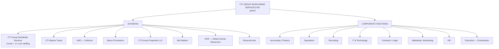
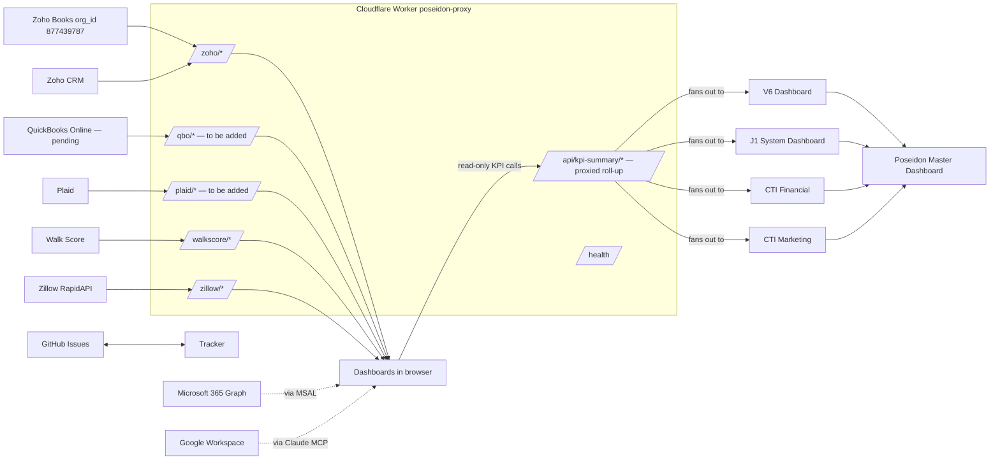

# Poseidon Master Dashboard — Architecture (Phase 1)

**Status:** Living document. Phase 1 baseline 2026-05-11.
**Audience:** Implementor (Claude Code), Agents A/B/C/D, future maintainers.
**Companions:** `POSEIDON-MASTER-AUDIT.md` (the Phase 0 audit) · `POSEIDON-STYLE-TOKENS.md` (visual contract) · `ASSUMPTIONS.md` (default decisions) · `INTEGRATION-CONTRACT.md` (the `/api/kpi-summary` contract).

---

## 1. Hierarchy (org chart)

The Master Dashboard renders this hand-drawn as `docs/poseidon-org-mindmap.html` (Phase 2 deliverable, embedded on the Overview tab).

---

## 2. Dashboard ownership map

| Dashboard | URL | Owner data domain | Reads from | Writes to | Visibility |
|---|---|---|---|---|---|
| **Poseidon Master** *(new)* | `…/Poseidon/poseidon-master-dashboard.html` | Cross-division roll-up | Every divisional `/api/kpi-summary` | Nothing (read-only viewport) | CTI exec internal |
| **Poseidon V6** *(existing)* | `…/Poseidon/poseidon-dashboard-v6.html` | Cruise / MLC staffing, contracts, IT, partner directory | Zoho CRM (Cruise modules), Zoho Books snapshot, M365 | Zoho CRM Cruise modules | CTI internal |
| **J1 System** *(existing)* | `…/Poseidon/j1-system-dashboard.html` | J-1 visa pipeline, J-1 housing, sponsors | Zoho CRM J-1 modules, M365, Housing Finder | Zoho CRM J-1 modules | CTI internal |
| **J1 Housing Finder** *(existing)* | `…/Poseidon/j1-housing-finder-index.html` | Direct-owner rental search | Zillow (via Worker), Walk Score (via Worker), OSM | Zoho CRM hosting/housing custom modules | CTI internal |
| **Tracker** *(existing)* | `…/Poseidon/tracker.html` | Cross-division tasks | GitHub Issues API | GitHub Issues API | CTI internal |
| **Contracts** *(existing)* | `…/Poseidon/contracts/` | Cruise line contract comparison | Static contract data | None | CTI internal |
| **CTI Command Center** *(existing)* | `…/cti-command-center/` | J-1 competitive intelligence | Google Sheets (live), State Dept stats | None | CTI internal |
| **CTI Financial** *(new — evolves from Upchurch Financial)* | `…/Poseidon/cti-financial-dashboard.html` | All CTI finance: cash, AR/AP, P&L, tax, J-1 housing finance, recruiting margin | Zoho Books, (future QBO), Plaid, J1 System (rollup only) | Zoho Books invoices (future) | CTI exec internal |
| **CTI Marketing** *(new)* | `…/Poseidon/cti-marketing-dashboard.html` | Campaigns, ROI/CAC, content calendar, lead attribution | Zoho CRM Leads, Google Drive (assets), manual ad spend | Zoho CRM Leads (UTM enrichment) | CTI internal |
| **Cruise Web Portal** *(new)* | `…/cti-cruise-portal/` | Public Cruise candidate intake | Static content | Zoho CRM `Candidates` (Cruise) | Public |
| **GHR Web Portal** *(new)* | `…/ghr-portal/` | Public J-1 + land hospitality candidate intake | Static content + sponsor list | Zoho CRM `J1_Candidates` + hospitality module | Public |
| **Upchurch Financial** *(existing, kept frozen)* | `upchurch-financial-dashboard.pages.dev` | Personal + litigation tracking | Hand-coded data arrays | None | Robert-only (password gate) |

**Rule:** every internal divisional dashboard exposes `/api/kpi-summary` (see `INTEGRATION-CONTRACT.md`). The Master reads them and never writes back.

---

## 3. Data flow

**Why the Worker is canonical:**
- One CORS allowlist (`https://robert-upchurch.github.io`) instead of per-dashboard.
- Secrets (Zoho refresh token, Plaid client secret, QBO refresh token, Walk Score key, Zillow key) live in Worker Secrets — never in browser source.
- Per-route 50-minute token cache for Zoho.
- Single point to rate-limit, log, and rotate keys.

---

## 4. Update cadence (per source)

| Source | Cadence | Mechanism |
|---|---|---|
| Plaid balances | 15 min | Worker cron → cache |
| Plaid transactions | 1 hour | Worker cron → cache |
| Zoho Books cash / AR / AP | 15 min | Worker → Zoho API |
| Zoho Books P&L | Daily 06:00 ET | Worker cron, persist snapshot |
| Zoho Books biweekly close (full snapshot + PDF) | Every other Monday 07:00 ET | Worker scheduled job, render PDF, email to ceo@cti-usa.com |
| QBO (when wired) | Same as Zoho Books | Same Worker path |
| Zoho CRM J-1 + Cruise candidate counts | Mon/Wed/Fri 06:00 ET | Worker cron → cache |
| Zoho CRM Tasks (real-time triggers) | On user request | Worker passthrough, no cache |
| M365 emails | 5 min | Browser MSAL token → Graph |
| M365 calendar/tasks | 15 min | Browser MSAL token → Graph |
| Google Drive | 15 min | Browser via Claude MCP (no Worker) |
| Walk Score | On user search | Worker → API |
| Zillow listings | On user search | Worker → RapidAPI |
| Tracker / GitHub issues | Real-time | Browser → GitHub API |

---

## 5. Authentication / authorization

**Internal dashboards:**
- Password gate (SHA-256 + salt, 24-hour localStorage session) — unchanged from v6.
- MSAL 3.6.0, Azure Client ID `aff2df6d-cd54-48f3-bd24-3584fd9ea3de`, scopes: `User.Read, Mail.Read, Calendars.Read, Tasks.Read, Files.Read`. Pending upgrade: `Files.ReadWrite` (needed by portals and biweekly PDF email).
- Worker calls authenticated by header `X-Dashboard-Token` (rotates per quarter, stored in `localStorage` after first paint, never logged).

**Public portals:**
- Marketing pages: anonymous.
- Application form: anonymous, POST through Cloudflare Worker route `/portal/<entity>/apply`. Worker enforces CORS origin + reCAPTCHA Enterprise score.
- Candidate status check (`/track/<token>`): the candidate clicks an emailed signed JWT link (24-hour TTL). The page validates the token client-side and pulls candidate status via Worker `/portal/<entity>/status/<token>`. No MSAL on candidate side.

**Authorization model:** single-tenant. There is no role-based view yet — every internal user sees everything they have the password for. Add roles in a v2 increment.

---

## 6. Partition rules (non-negotiable, enforced everywhere)

Inherited verbatim from `config/jarvis-memory.md` and made physical:

- **Cruise/MLC data** lives on `poseidon-dashboard-v6.html` and `cti-cruise-portal`. Storage: Zoho CRM `Candidates` (CustomModule13), all `Seaman_*` / `Marlins_*` / `STCW_*` / `Bermuda_*` file upload modules, contracts/* directory.
- **J-1 data** lives on `j1-system-dashboard.html`, `j1-housing-finder-index.html`, and `ghr-portal`. Storage: Zoho CRM `J1_Candidates` (CustomModule12), `J1_Participants1` (CustomModule22), `J1_Visa_Stage_*` modules (CustomModule6/8/9/10), `Hosting_Companies` (CustomModule18), `J1_Partners_Agents` (CustomModule20).
- **Land hospitality** rides with J-1 (GHR), stored in `J_1_Hospitalities_Bangkok` (CustomModule17) or a new `Hospitality_Candidates` module — decision in `ASSUMPTIONS.md` §Q28.
- **CTI Group Worldwide Services** uses Cruise modules.
- **The Master Dashboard reads aggregate roll-ups only.** No candidate-level records cross the partition. Specifically:
  - J1 System exposes `/api/kpi-summary?scope=j1` returning totals (count, $-rollup); no PII.
  - V6 exposes `/api/kpi-summary?scope=cruise` returning totals; no PII.
  - The CTI Financial Dashboard sees J-1 housing finance totals only, never candidate names.
- **Jarvis** can speak across both via `read_remote_dashboard`. The cross-dashboard sync uses `BroadcastChannel cti-poseidon-sync` and `localStorage` snapshots — these snapshots carry **aggregate KPIs only**, never row-level data.

Violations are easy to spot: any row-level field with a candidate's name appearing on the wrong dashboard fails CI (lint rule to be added in Phase 3).

---

## 7. Backend (Cloudflare Worker `poseidon-proxy`)

### 7.1 Existing routes (in `docs/cloudflare-worker-template.js`)

| Route | Method | Purpose |
|---|---|---|
| `/health` | GET | Liveness probe |
| `/zoho/<module>` | GET | List records (paginated) |
| `/zoho/<module>/<id>` | GET | Single record |
| `/zoho/<module>/<id>` | PUT | Update record |
| `/walkscore` | GET | Walk Score lookup |
| `/zillow` | GET | Zillow RapidAPI passthrough |

### 7.2 Routes to add (Phase 3, Agents B + D)

| Route | Method | Purpose | Owner |
|---|---|---|---|
| `/qbo/companyinfo` | GET | QBO `CompanyInfo` once realm wired | Agent B |
| `/qbo/accounts/balance` | GET | QBO bank balances | Agent B |
| `/qbo/transactions` | GET | QBO transactions | Agent B |
| `/qbo/invoices` | GET/POST | QBO invoicing | Agent B |
| `/plaid/link-token` | POST | Create Link token for candidate flow | Agent B |
| `/plaid/exchange` | POST | Public token → access token | Agent B |
| `/plaid/balance` | GET | Plaid balances | Agent B |
| `/plaid/transactions/sync` | GET | Plaid `/transactions/sync` | Agent B |
| `/api/kpi-summary` | GET | Master roll-up aggregator (calls each dashboard's KPI feed) | Agent A |
| `/portal/cruise/apply` | POST | Cruise portal candidate intake | Agent D |
| `/portal/cruise/status/<token>` | GET | Cruise candidate status check | Agent D |
| `/portal/ghr/apply` | POST | GHR portal candidate intake | Agent D |
| `/portal/ghr/status/<token>` | GET | GHR candidate status check | Agent D |
| `/marketing/lead-attribution` | POST | UTM enrichment workflow | Agent C |

### 7.3 Worker secrets (additions)

| Secret | Source | For |
|---|---|---|
| `QBO_CLIENT_ID` / `QBO_CLIENT_SECRET` / `QBO_REFRESH_TOKEN` / `QBO_REALM_ID` / `QBO_ENV` | Intuit Developer Console | QBO routes (deferred) |
| `PLAID_CLIENT_ID` / `PLAID_SECRET` / `PLAID_ENV` | dashboard.plaid.com | Plaid routes |
| `JWT_SIGNING_KEY` | Generated, 32-byte | Candidate status-check token signing |
| `RECAPTCHA_SECRET` | Google reCAPTCHA Enterprise | Portal intake spam protection |
| `DASHBOARD_TOKEN` | Generated, rotates quarterly | Worker auth header |
| `RESEND_API_KEY` *(or equivalent)* | resend.com | Outbound email (status-check link, biweekly PDF) |

### 7.4 Caching

- Token cache: in-memory, 50-min TTL for OAuth access tokens.
- KPI roll-up cache: KV namespace `kpi-cache`, 15-min TTL, keyed by scope.
- Snapshot files served from the GitHub repo (`config/zoho-books-snapshot.json`) act as a 24-hour fallback if the live route is unavailable.

---

## 8. Deployment

- **Internal dashboards** (Poseidon, Master, Financial, Marketing): GitHub Pages from `main` branch of `Robert-Upchurch/Poseidon`.
- **Portals**: GitHub Pages from `main` branch of `Robert-Upchurch/cti-cruise-portal` and `Robert-Upchurch/ghr-portal` (project sites: `*.github.io/<repo>/`). MVP only — final cti-usa.com/cruise/ etc. domain decision deferred per Robert.
- **Cloudflare Worker**: deployed manually by Robert via the dash on first setup; subsequent updates via Wrangler from CI (TBD). Until Wrangler CI exists, Agent B documents every code change in `docs/CLOUDFLARE-WORKER-CHANGELOG.md`.
- **Cron jobs**: configured on the Worker via the Cloudflare dash → Triggers tab.

---

## 9. Failure modes & fallbacks

| Failure | Behavior |
|---|---|
| Worker offline | Dashboards fall back to last-good snapshot from `config/*.json`. Banner: "Data >1h old — live feed offline." |
| Zoho rate limit | Exponential backoff in Worker, surface 429 to dashboard, snapshot fallback. |
| Plaid Item login required | Surface red banner on Financial Dashboard with re-link button. |
| M365 token expired | MSAL silent refresh; on failure, show login modal. |
| GitHub Pages build fail | Static site continues serving previous deploy. CI status surfaces via GitHub Actions. |
| Master `/api/kpi-summary` partial failure | Master renders cards with last-good values + a small "stale" badge per failed child. Never blocks the whole page. |

---

## 10. Conventions (Agents A/B/C/D follow these)

- **Branching:** feature branches `feat/master`, `feat/finance`, `feat/marketing`, `feat/portals` off `main`. Squash-merge when integration check passes.
- **Commits:** Conventional Commits (`feat:`, `fix:`, `chore:`, `docs:`).
- **No bundlers, no transpilers.** Single-file HTML + Tailwind CDN + vanilla JS in modules.
- **Light + dark mode mandatory** on every new page. Pre-paint inline script required.
- **Every page sets `data-jarvis-context`** at the root element so Jarvis can read the active context.
- **Every page calls `lucide.createIcons()`** once after first paint.
- **Every Worker route** must have a unit test (`tests/worker/<route>.test.js`) and a curl example in the route's JSDoc.
- **No secrets in client.** Anything sensitive routes through the Worker.
- **Agent log:** each agent writes one line per session to `docs/AGENT-LOG.md`.

---

## 11. Out of scope for this build

- Multi-entity Zoho Books migration (cost surfaced in `ASSUMPTIONS.md`).
- Stripe / non-Zoho payment processors.
- Role-based access control inside the dashboards.
- Replacing the password gate with full SSO.
- Migrating the public `cti-usa.com` site (WordPress vs. static is its own decision per `ASSUMPTIONS.md`).
- YouTube / podcast analytics API integration (Phase 5b).
- Production Plaid (Sandbox → Development first; Production after Robert's sign-off on cost).
- GDPR DPO appointment.

---

*End Phase 1 architecture.*
